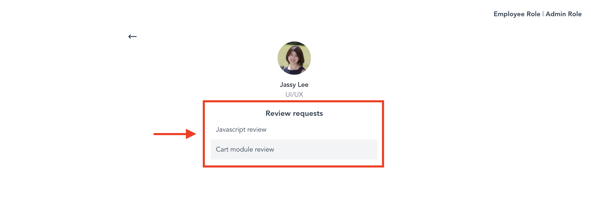
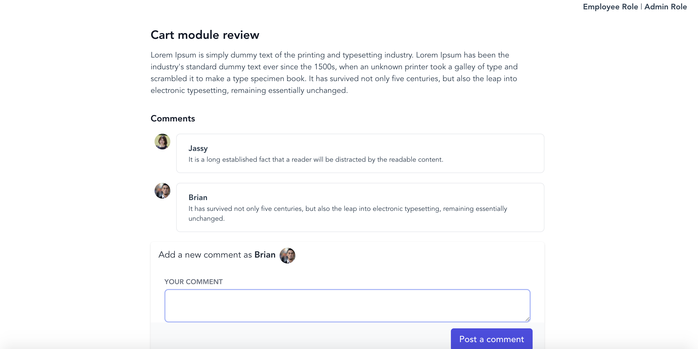
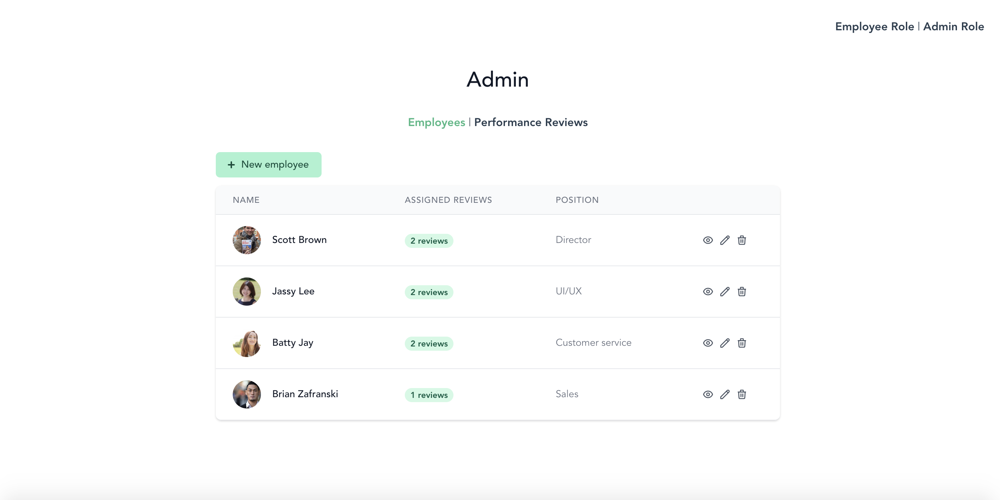
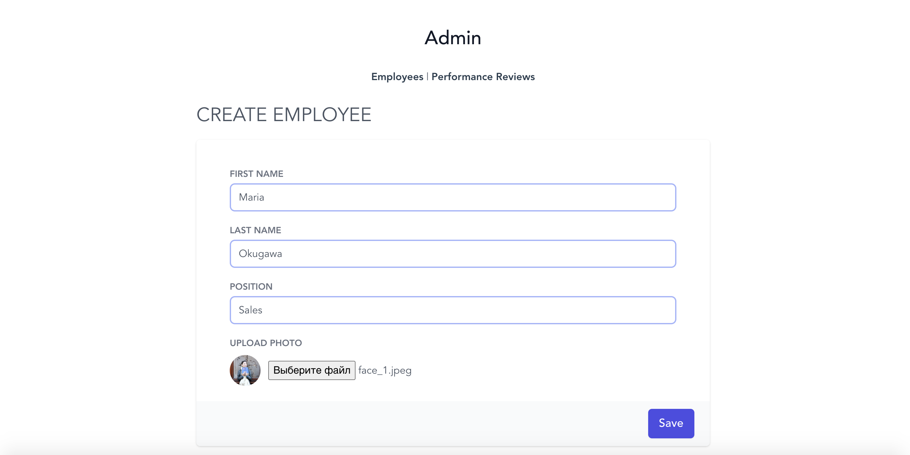
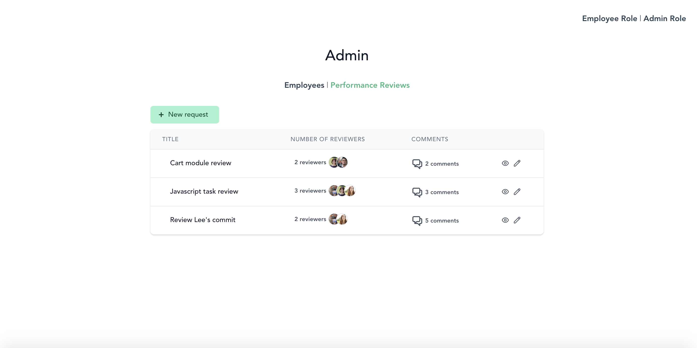
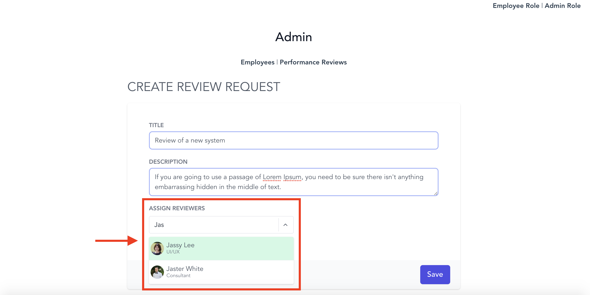
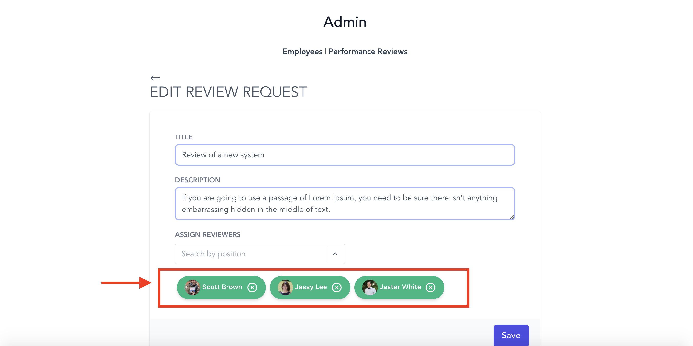
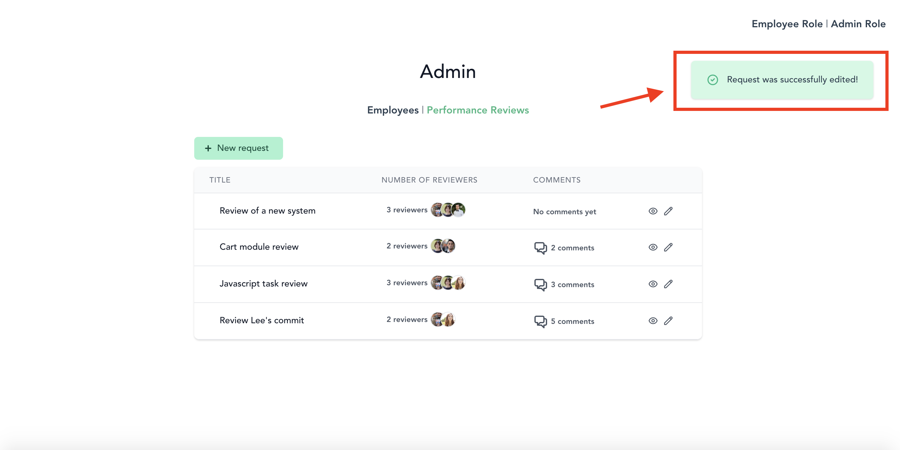

I used "VueJS" and "Tailwind CSS" to create this project.

There are 2 modes: Employee and Admin. You can switch between them, using tabs on the right top corner of the screen.


### Employee Mode

Using Employee mode, you can access any profile of existing employees.

On the profile page of an employee, you can see a list of review requests, assigned to this particular employee if any.


Employee can access any review request pages, he/she is assigned to and leave a comment on that review request.


### Admin Mode

In Admin mode you have 2 tabs: Employees and Performance Reviews
Using Admin mode, you can access, create, update, delete account of any existing employee.



Employee account contents avatar(I used firebase for storing images)


Admin also can create, edit see the content of any request. When reviewers are assigned, their avatars are displayed on the request card.


When Admin creates a new review request, he/she can assign anybody from existing employees, by selecting by first names.



Selected employees are displayed under input field.



There is a notification in the right top corner each time Admin creates, edits employee or request.



### Further improvements

Due to time constraints the Backend wasn't implemented. I used "json server" RESTful API instead of making a full backend server.

My further improvement regarding this project are:

- Implementing Ruby on Rails RESTful API with a MySQL database for the Backend.
- Implementing Axios library as the HTTP client, in order to perform GET, POST, PUT and DELETE operations to the Backend.
- Implementing Vuex for state management on the Frontend.

## Project setup

Run the follow commands

```
npm install

npm run serve

json-server --watch db/db.json
```
