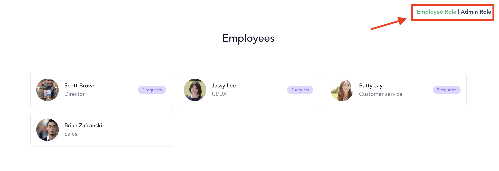

I used "VueJS" and "Tailwind CSS" to create this project.

There are 2 modes: Employee and Admin. You can switch between them, using tabs on the right top corner of the screen.




### Employee Mode

Using Employee mode, you can access any profile of existing employees. 

On the profile page of an employee, you can see a list of review requests, assigned to this particular employee if any.

Employee can access any review request pages, he/she is assigned to and leave a comment on that review request.

### Admin Mode
Using Admin mode, you can access, create, update, delete account of any existing employee.

Employee account contents avatar(I used firebase for storing images)


## Project setup

```
npm install
```

### Compiles and hot-reloads for development

```
npm run serve
```

### Compiles and minifies for production

```
npm run build
```

### Customize configuration

See [Configuration Reference](https://cli.vuejs.org/config/).
